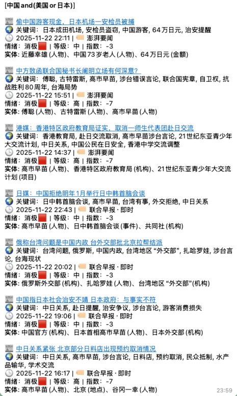
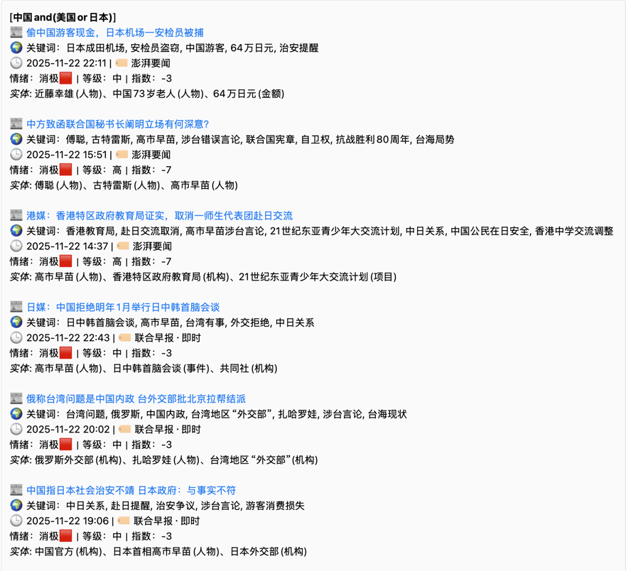

 <div align="center">

# 🚨 RadarFlow

**智能舆情监测新闻流水线**

[](https://www.python.org/downloads/)
[](LICENSE)
[](https://github.com/yourusername/RadarFlow/pkgs/container/radarflow)
[](https://github.com/yourusername/RadarFlow/actions)

*从抓取到推送，5 分钟搭建你的专属新闻雷达*

[快速开始](#-快速开始) • [功能特性](#-核心特性) • [配置说明](#-配置说明) • [新闻源](#-支持的新闻源)

</div>

---

## 📖 项目简介

RadarFlow 是一个轻量级、开箱即用的舆情监测系统，专为**舆情分析师**、**行业研究员**、**竞品情报团队**设计。

通过灵活的关键词规则 + AI 语义理解，从全球 20+ 主流媒体中自动筛选、分析、推送你关心的新闻。

### 为什么选择 RadarFlow？

| 传统方案 | RadarFlow |
|---------|-----------|
| 需要部署 Elasticsearch / Kafka | **SQLite 轻量存储** |
| 搭建大模型推理集群 | **兼容 OpenAI API** |
| 复杂的爬虫维护成本 | **统一抓取接口** |
| 手动筛选海量信息 | **智能三层过滤** |

---

## ✨ 核心特性

### 🎯 智能过滤系统

```
┌─────────────┐   ┌──────────────┐   ┌──────────────┐
│  AI 预过滤   │ → │  关键词过滤   │ → │  AI 后置过滤  │
│  语义初筛    │   │  精准匹配    │   │  情绪/主题    │
└─────────────┘   └──────────────┘   └──────────────┘
```

- **AI 预过滤**：跨语言语义理解，降低关键词遗漏
- **关键词过滤**：支持 AND/OR/NOT 组合逻辑
- **AI 后置过滤**：按情绪（消极/中性/积极）、主题分类推送

### 🤖 AI 增强能力

- ✅ 自动生成结构化摘要
- ✅ 情绪分析（等级 + 指数）
- ✅ 主题分类（政治/经济/军事等）
- ✅ 关键实体提取（人物/机构/地点）

### 📡 多渠道推送

支持主流办公协作工具：

- 企业微信 / 钉钉 / 飞书
- Telegram Bot
- Email

### 🔧 开发者友好

- **5 分钟部署**：pip install → 改配置 → 运行
- **扩展性强**：新增新闻源只需 20 行代码
- **全流程可配**：所有行为均可通过 YAML 控制

---

## 🚀 快速开始

### 前置要求

- Python 3.11+
- 一个 OpenAI 兼容的 API Key（DeepSeek / OpenAI / Azure）

### 1️⃣ 安装

```bash
git clone https://github.com/yourusername/RadarFlow.git
cd RadarFlow
pip install -r requirements.txt
```

### 2️⃣ 配置

```bash
cp config/config.example.yaml config/config.yaml
```

编辑 `config/config.yaml`，填入必要信息：

```yaml
# 关键词过滤规则
filters:
  enabled: true
  rules:
    - name: "中国 & 美日韩"
      all_of:
        - ["中国", "台湾", "香港"]
        - ["美国", "日本", "韩国"]

# AI 配置
ai:
  enabled: true
  base_url: "https://api.deepseek.com"
  model: "deepseek-chat"
  api_key: "sk-your-api-key-here"

# 通知渠道
notification:
  enable: true
  telegram:
    bot_token: "your-bot-token"
    chat_id: "your-chat-id"
```

完整配置说明见 [配置文档](#-配置说明)

### 3️⃣ 运行

**单次执行**
```bash
python main.py
```

**定时调度**（cron 式）
```bash
python scheduler.py
```

---

## 🎬 效果演示

### 推送示例

<table>
<tr>
<td width="50%">

**Telegram 推送**



</td>
<td width="50%">

**企业微信推送**



</td>
</tr>
</table>

### 消息格式

```
📰 偷中国游客现金，日本机场一安检员被捕
🌍 关键词：日本成田机场, 安检员盗窃, 中国游客, 64万日元
🕒 2025-11-22 22:11 | 🏷 澎湃要闻
情绪：消极🟥｜等级：中｜指数：-3
实体: 近藤幸雄(人物)、中国73岁老人(人物)、64万日元(金额)

📝 摘要：
日本成田机场一名安检员因涉嫌盗窃中国游客64万日元现金被捕...
```

---

## 🔧 配置说明

### 核心配置项

| 配置块 | 说明 | 必填 |
|--------|------|------|
| `timezone` | 时区设置 | ✅ |
| `filters` | 关键词过滤规则 | ✅ |
| `ai` | AI 摘要配置 | ⭕ |
| `ai_prefilter` | AI 预过滤 | ⭕ |
| `ai_filter` | AI 后置过滤 | ⭕ |
| `notification` | 推送渠道 | ✅ |

### 关键词过滤规则

支持灵活的布尔逻辑组合：

```yaml
filters:
  rules:
    - name: "规则名称"
      action: "allow"  # allow 或 deny
      all_of:          # 必须同时包含（AND）
        - ["中国", "台湾"]      # 二选一
        - ["美国", "日本"]      # 二选一
      none_of: ["广告", "招聘"]  # 不能包含（NOT）
```

**逻辑示例**：
- `all_of: [["中国", "台湾"], ["美国"]]` → `(中国 OR 台湾) AND 美国`
- `none_of: ["广告"]` → 标题/内容不包含"广告"

### AI 配置

```yaml
ai:
  enabled: true
  base_url: "https://api.deepseek.com"
  model: "deepseek-chat"
  api_key: ""  # 或通过环境变量 OPENAI_API_KEY
  temperature: 0.3
  max_workers: 4              # 并发数
  use_article_body: true      # 传递全文给 AI
  identity_hint: "你是资深新闻编辑..."  # 影响情绪判断的系统提示
```

### 调度配置

```yaml
scheduler:
  enabled: true
  run_on_start: true    # 启动后立即执行一次
  cron:
    - "0 * * * *"       # 每小时整点
    - "30 9-20 * * *"   # 9:30-20:30 每半小时
```

---

## 🌐 支持的新闻源

### 国际主流媒体

| 媒体 | 语言 | 覆盖领域 |
|------|------|---------|
| BBC News | 英文 | 全球新闻 |
| BBC 中文 | 中文 | 国际时事 |
| The Guardian | 英文 | 深度报道 |
| Al Jazeera | 英文 | 中东/国际 |
| Daily Mail | 英文 | 综合新闻 |
| SCMP（南华早报）| 英文 | 亚洲/中国 |

### 亚太地区

| 媒体 | 语言 | 覆盖领域 |
|------|------|---------|
| 联合早报 | 中文 | 东南亚/中国 |
| 8world 新闻 | 中文 | 新加坡本地 |
| CNA（亚洲新闻台）| 英文 | 东南亚 |
| Yahoo News | 英文 | 综合新闻 |
| 朝日新闻 | 日文 | 日本 |
| 韩联社（YNA）| 韩文 | 韩国 |
| VNExpress | 越南文 | 越南 |
| ABS-CBN | 英文 | 菲律宾 |

### 中文媒体

| 媒体 | 覆盖领域 |
|------|---------|
| 澎湃新闻 | 时政/财经 |
| 环球网 | 国际新闻 |
| 自由时报 | 台湾新闻 |
| VOA 中文 | 国际时事 |
| RFI 法广 | 国际新闻 |

> 💡 **扩展新源只需 20 行代码** - 详见 [开发文档](#-开发者指南)

---

## 📁 项目结构

```
RadarFlow/
├── fetcher/               # 新闻源抓取器
│   ├── base_fetcher.py   # 基类
│   ├── bbc_news.py       # BBC 英文
│   ├── scmp.py           # 南华早报
│   └── ...               # 其他 20+ 新闻源
├── ai/                    # AI 处理模块
│   ├── client.py         # AI 摘要生成
│   ├── prefilter.py      # AI 预过滤
│   └── filter.py         # AI 后置过滤
├── filters.py             # 关键词过滤引擎
├── notifications.py       # 多渠道推送
├── deduper.py            # 去重逻辑
├── main.py               # 主入口
├── scheduler.py          # 定时调度
└── config/
    └── config.example.yaml  # 配置示例
```

---

## 🛠️ 开发者指南

### 新增新闻源

继承 `BaseFetcher` 实现 `fetch()` 方法：

```python
from fetcher.base_fetcher import BaseFetcher
from fetcher.base import NewsRecord

class MyNewsFetcher(BaseFetcher):
    def fetch(self) -> list[NewsRecord]:
        # 1. 抓取 HTML
        html = self.fetch_html("https://example.com/news")

        # 2. 解析数据
        soup = self.parse_html(html)
        articles = soup.select(".article")

        # 3. 返回 NewsRecord 列表
        return [
            NewsRecord(
                title=article.select_one(".title").text,
                url=article.select_one("a")["href"],
                published_at="2025-01-01 12:00",
                source="MyNews",
                content=article.select_one(".content").text
            )
            for article in articles
        ]
```

在 `fetcher/__init__.py` 注册：

```python
from .my_news import MyNewsFetcher

def collect_news():
    yield from MyNewsFetcher().fetch()
```

### 环境变量支持

敏感信息建议使用环境变量：

```bash
export OPENAI_API_KEY="sk-your-key"
export TELEGRAM_BOT_TOKEN="123456:ABC-DEF"
export WEWORK_WEBHOOK="https://qyapi.weixin.qq.com/..."
```

配置中留空时自动读取环境变量。

---

## 🐳 Docker 部署

### 使用 GitHub Container Registry 镜像（推荐）

无需构建，直接拉取预构建镜像：

```bash
# 拉取最新版本
docker pull ghcr.io/yourusername/radarflow:latest

# 运行容器
docker run -d \
  --name radarflow \
  --restart unless-stopped \
  -v $(pwd)/config:/app/config \
  -v $(pwd)/state:/app/state \
  -e OPENAI_API_KEY="sk-your-key" \
  -e TELEGRAM_BOT_TOKEN="your-token" \
  ghcr.io/yourusername/radarflow:latest
```

### 使用 docker-compose（推荐）

创建 `docker-compose.yml`：

```yaml
version: '3.8'

services:
  radarflow:
    image: ghcr.io/yourusername/radarflow:latest
    container_name: radarflow
    restart: unless-stopped
    volumes:
      - ./config:/app/config
      - ./state:/app/state
    environment:
      - OPENAI_API_KEY=${OPENAI_API_KEY}
      - TELEGRAM_BOT_TOKEN=${TELEGRAM_BOT_TOKEN}
      - TELEGRAM_CHAT_ID=${TELEGRAM_CHAT_ID}
      - WEWORK_WEBHOOK=${WEWORK_WEBHOOK}
    env_file:
      - .env  # 可选：从 .env 文件加载环境变量
```

启动服务：

```bash
docker-compose up -d
```

### 本地构建镜像

```bash
docker build -t radarflow .
docker run -d \
  --name radarflow \
  -v $(pwd)/config:/app/config \
  -v $(pwd)/state:/app/state \
  -e OPENAI_API_KEY="sk-xxx" \
  radarflow
```

### 镜像版本说明

| 标签 | 说明 |
|------|------|
| `latest` | 最新稳定版（跟踪 main 分支） |
| `v1.0.0` | 具体版本号 |
| `v1.0` | 主要版本号 |
| `main` | 开发版本（main 分支） |

---

## 🗺️ 使用场景

| 场景 | 如何使用 RadarFlow |
|------|-------------------|
| 🏛️ **舆情监控** | 设置关键词规则，监测企业/政府相关负面新闻 |
| 🔍 **竞品分析** | 跟踪竞品公司名称、产品发布、融资动态 |
| 📊 **行业研究** | 订阅特定领域关键词，AI 摘要节省阅读时间 |
| ⚠️ **危机预警** | 多渠道同步推送，第一时间响应突发事件 |
| 📰 **媒体简报** | 定时生成行业日报，自动化内容聚合 |

---

## 🧭 Roadmap

- [x] 多源新闻抓取（20+ 主流媒体）
- [x] 关键词 + AI 双重过滤
- [x] AI 摘要 / 情绪 / 主题分析
- [x] 多渠道推送（企微/钉钉/飞书/Telegram）
- [x] SQLite 去重持久化
- [ ] Web 管理控制台
- [ ] 规则可视化编辑器
- [ ] RSS / 社交媒体源支持
- [ ] 自定义推送模板
- [ ] 趋势分析 & 数据看板

---

## 🤝 贡献指南

欢迎提交 Issue 和 Pull Request！

- 🐛 发现 Bug？[提交 Issue](https://github.com/yourusername/RadarFlow/issues)
- 💡 有新想法？[发起讨论](https://github.com/yourusername/RadarFlow/discussions)
- 🔌 添加新闻源？参考 [开发文档](#-开发者指南)

---

## 📄 License

[MIT License](LICENSE)

---

## ⭐ Star History

如果这个项目对你有帮助，请点个 Star ⭐

你的支持是我们持续更新的动力！

---

<div align="center">

**Built with ❤️ by RadarFlow Team**

[GitHub](https://github.com/yourusername/RadarFlow) • [Documentation](https://github.com/yourusername/RadarFlow/wiki) • [Report Bug](https://github.com/yourusername/RadarFlow/issues)

</div>
